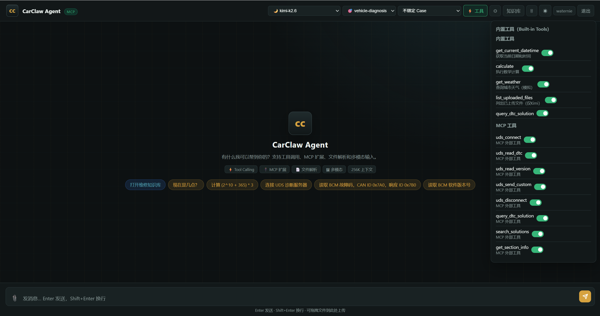
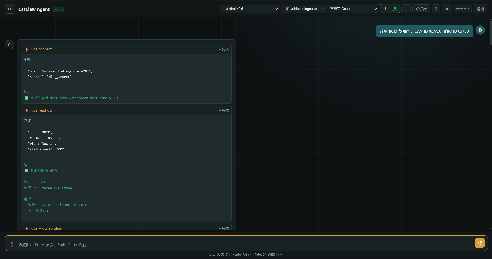
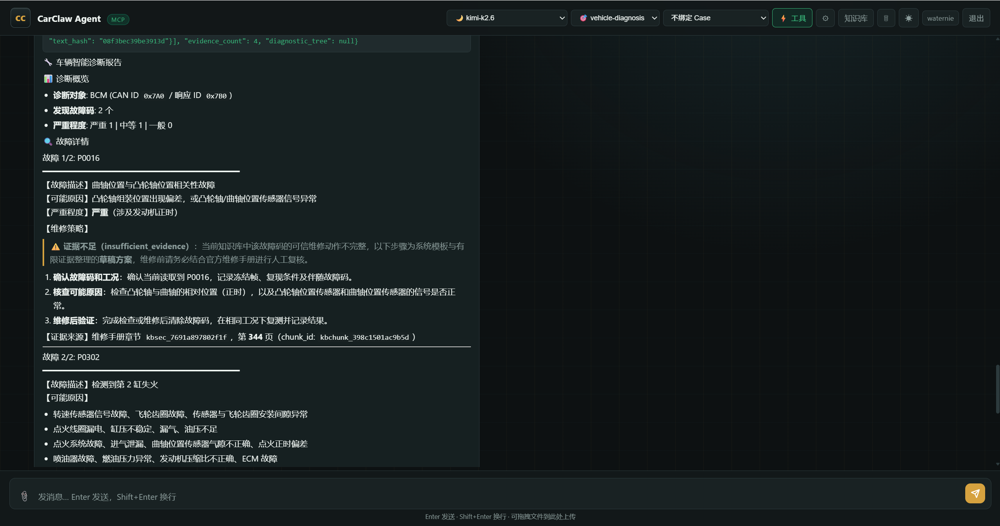
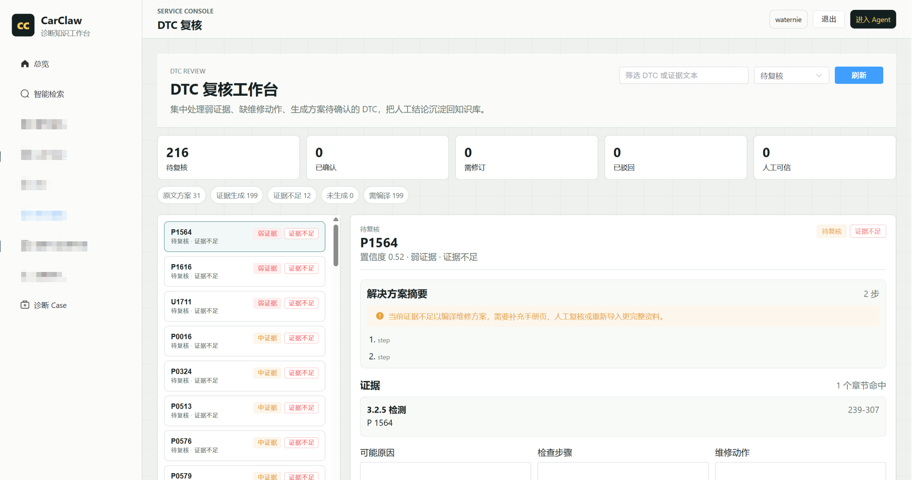
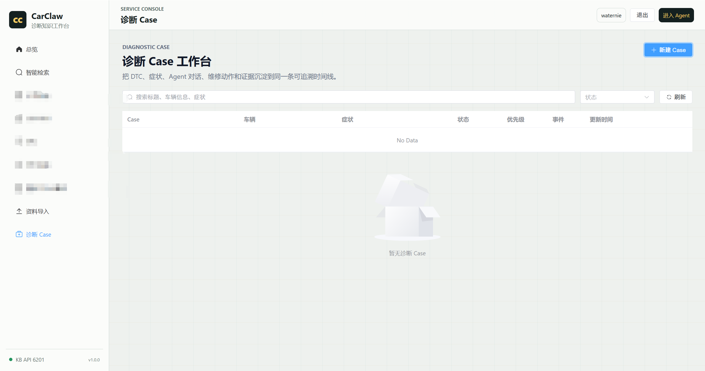

# CarClaw

CarClaw is an open workflow specification for building **vehicle diagnostic AI agents**.

It is not "ChatGPT plus a DTC explanation." CarClaw is an **evidence-first vehicle diagnostic agent protocol** that organizes vehicle symptoms, DTCs, service-manual evidence, diagnostic reasoning, next inspection steps, and repair reports into a traceable and reviewable diagnostic loop.

```text
Vehicle symptom / DTC
  -> evidence lookup
  -> diagnostic reasoning
  -> next inspection steps
  -> repair note
  -> auditable report
```

## Why this exists

The dangerous part of a vehicle diagnostic agent is not that it fails to answer. The dangerous part is when it:

- gives a final diagnosis without evidence
- writes AI inference as if it were manual evidence
- fabricates torque, fluid, voltage, pinout, or repair steps
- performs write operations without authorization and a safety workflow

CarClaw opens the protocol, boundaries, and report structure first, so vertical diagnostic agents can be evidence-aware and auditable from day one.

## Documentation

| Document | 中文 | English |
|---|---|---|
| Overview | [README.md](./README.md) | [README.en.md](./README.en.md) |
| Agent protocol | [AGENTS.md](./AGENTS.md) | [AGENTS.en.md](./AGENTS.en.md) |
| Diagnostic skill | [SKILL.md](./SKILL.md) | [SKILL.en.md](./SKILL.en.md) |
| Demo flow | [docs/demo.md](./docs/demo.md) | - |
| Architecture | [docs/architecture.md](./docs/architecture.md) | - |
| Roadmap | [ROADMAP.md](./ROADMAP.md) | - |

## Screenshots

### Agent tool panel



### DTC reading and tool calls



### Evidence-first diagnostic report



### DTC review workbench



### Diagnostic Case workbench



## What is included

- `AGENTS.md`: public operating protocol for vehicle diagnostic agents.
- `SKILL.md`: read-only vehicle diagnostic skill for MCP tools, function tools, local scripts, or other agent runtimes.
- `README.md`: project positioning, open-source boundary, and usage notes.
- `docs/demo.md`: a demo flow from DTC to an evidence-first diagnostic report.
- `.github/ISSUE_TEMPLATE/`: templates for protocol issues, evidence field suggestions, and tool adapter feedback.

The public version is intentionally small. It is useful as a protocol sample, teaching material, safety-review artifact, or proof-of-concept starting point.

## What is not included

This public repository does not include:

- proprietary service manuals
- customer repair data
- vehicle-specific ECU configuration
- CAN ID or response ID databases
- real hardware adapters
- commercial parsing rules
- production deployment code
- credentials or private environment files

Those belong in private deployments, customer projects, or commercial editions.

## Community scope

The community version is designed for:

- mock diagnostic environments
- read-only DTC workflows
- service-manual evidence retrieval
- agent instruction design
- safety boundary review
- proof-of-concept demos

It should not be used to control a real vehicle without additional safety review, explicit user authorization, hardware validation, and compliance review.

## Recommended architecture

```text
User / technician
  -> Diagnostic Agent
  -> Diagnostic Skill
  -> Read-only diagnostic tool
  -> Knowledge lookup tool
  -> Evidence-first report
```

Recommended logical tool capabilities:

- `diagnostic_connect`: connect to a mock or authorized diagnostic data source.
- `diagnostic_read_dtc`: read DTCs.
- `knowledge_query_dtc_solution`: query evidence and repair clues for one DTC.
- `knowledge_search`: search service-manual evidence by symptom, part, or system.
- `case_record_event`: optionally record diagnostic case audit events.

These logical tools can be mapped to MCP tools, function tools, HTTP APIs, local scripts, or your own agent runtime.

## Safety principles

- Service manuals, structured evidence, and verified diagnostic data are the source of truth.
- Separate user statements, tool results, manual evidence, and AI inference.
- Do not invent DTC meanings, torque values, fluid specs, pinouts, voltage ranges, or repair steps.
- If evidence is missing, say that the current knowledge base is insufficient.
- The community version does not include write operations by default.
- Do not authorize clearing DTCs, writing ECU configuration, actuator tests, calibration, flashing, or custom UDS commands in the community skill.

## Open source strategy

This repository is the public protocol layer.

Recommended open core boundary:

- Open source: protocol, read-only skill, mock tools, demo data, report structure.
- Commercial or private: customer manuals, data cleaning, brand-specific parsing rules, real hardware adapters, team workflow, deployment, maintenance, and support.

## Status

This is an early public protocol package. It can be used as a reference for agent workflow design, but it is not a complete vehicle diagnostic product.

## Contributing

Issues and pull requests are welcome, especially around:

- DTC evidence fields
- diagnostic report structure
- read-only tool contracts
- mock case examples
- agent runtime adaptation notes

Please read [CONTRIBUTING.md](./CONTRIBUTING.md) before larger changes.

## License

This community protocol package is released under the [MIT License](./LICENSE).
